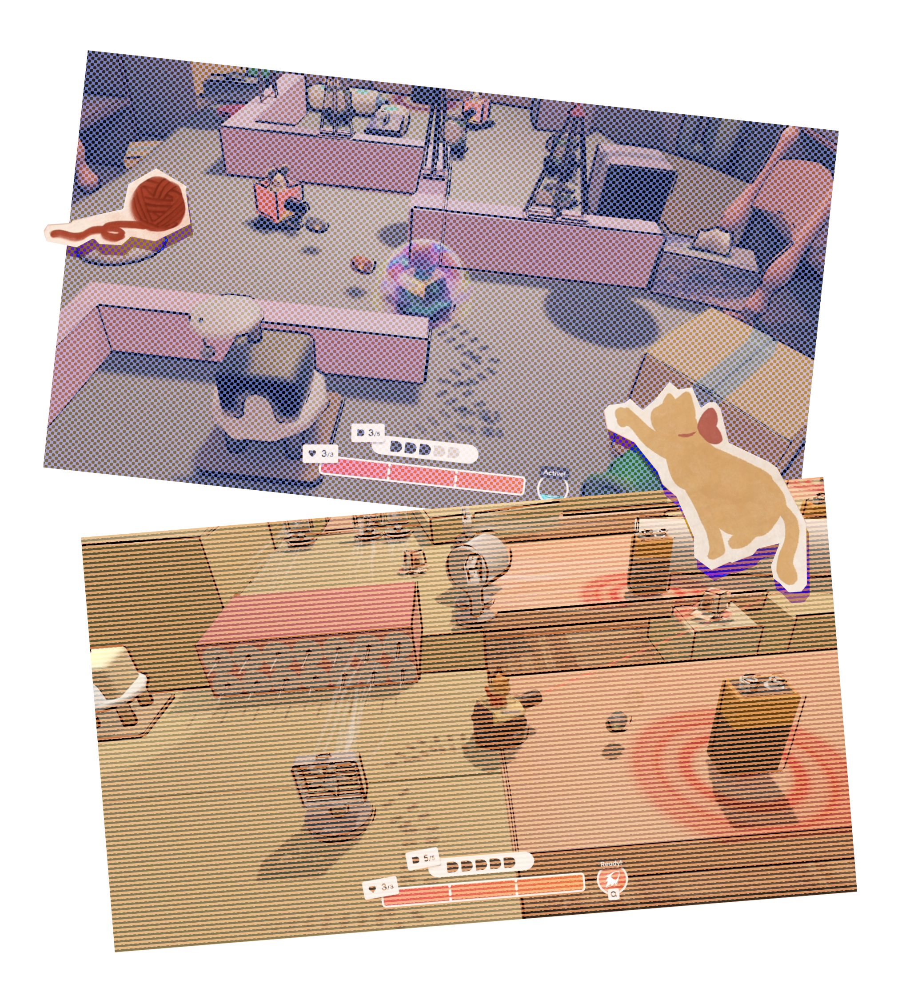
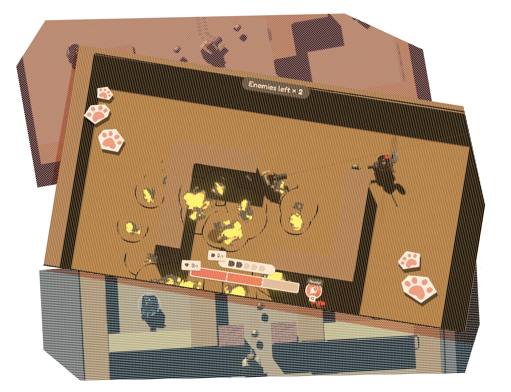

# Catanks

Blast your way through feline fun with Catanks!  Follow an immersive level-styled campaign with unique rodent enemies and homely yet hazardous environments, or battle nonstop against explosive combatants in riveting classic missions.

Catanks is a 3D game created by students from UPGRADE (University of Pennsylvania Game Research and Development Environment), reimagining nostalgic tank combat with decisive third-person cat-piloted gameplay.

## Download From
- [Steam](https://store.steampowered.com/app/3793790)
- [Itch.io](https://pennupgrade.itch.io/catanks)
- [Github](https://github.com/pennupgrade/couverture/releases)

## Features
- 6 Campaign levels
- 50 Arcade-style Classic Mode levels
- 2 Characters with special abilities
- 12 Achievements to unlock (with achievement support on the Steam release and the Itch.io/Github release!)
- Multiple save slots

## Licensing
Licensing for this repository is [REUSE](https://reuse.software) compliant.  License information for each file is either in the header of the file (for most scripts) or in REUSE.toml

### Open Source
Almost all content in this repository is licensed under an open source license.

All UPGRADE-contributed script, shader, material, prefab, and animation files are licensed under the MPL 2.0 license.

All UPGRADE-contributed art is licesed under the CC BY-SA 4.0 license.

Various sound effects (that were found on [freesound.org](https://freesound.org)) are licensed under a variety of open licenses (see REUSE.toml).  See the [sound effects section](#sound-effects) for links to the original sounds.

[LeanTween](https://assetstore.unity.com/packages/tools/animation/leantween-3595) and [BetterMinimal](https://github.com/seleb/Better-Minimal-WebGL-Template) are licensed under the MIT license.

### Proprietary
The default TextMesh Pro shaders (and a few other assorted TextMeshPro files) are licensed under the Unity Companion License (due to TextMesh Pro being licensed that way).

UPGRADE branding is not open source.  If you decide to fork this project, replace the UPGRADE branding (located in `Tanks/Assets/UPGRADE Branding/`) with art that you own or have the rights to use.

## Building
Catanks was made using Unity version 2022.3.16f1

### Itch.io/Github Release
Build the game as normal, but ensure that the `DISABLESTEAMWORKS` compilation symbol is defined (see below).

## Steam Release
Remove the `DISABLESTEAMWORKS` compilation symbol.  This is done by going to `Edit>Project Settings>Player>Settings For Windows, Mac, Linux>Other Settings>Script Compilation>Scripting Define Symbols` in the Unity Editor and removing the entry that says `DISABLESTEAMWORKS`.  Then, build the game as normal.

## Sound Effects
List of links to sounds used for sound effects:
- <https://freesound.org/s/573797/>
- <https://freesound.org/s/539957/>
- <https://freesound.org/s/401198/>
- <https://freesound.org/s/582462/>
- <https://freesound.org/s/548352/>
- <https://freesound.org/s/617056/>
- <https://freesound.org/s/111361/>
- <https://freesound.org/s/647556/>
- <https://freesound.org/s/646957/>
- <https://freesound.org/s/615893/>
- <https://freesound.org/s/128296/>
- <https://freesound.org/s/637245/>
- <https://freesound.org/s/154934/>
- <https://freesound.org/s/521105/>
- <https://freesound.org/s/555063/>
- <https://freesound.org/s/800274/>
- <https://freesound.org/s/814052/>
- <https://freesound.org/s/386790/>
- <https://freesound.org/s/201159/>
- <https://freesound.org/s/151713/>
- <https://freesound.org/s/45650/>
- <https://freesound.org/s/467882/>
- <https://freesound.org/s/136542/>
- <https://freesound.org/s/410559/>
